# ⚡ [Live Site](https://energyflowindustrial.netlify.app/) — EnergyFlow Industrial Tracker


> 🧠 Industrial-grade intelligence meets sustainability — a sleek, AI-enhanced resource tracker for modern factories.

---

## 🌐 Live Demo

🔗 [https://energyflowindustrial.netlify.app/](https://energyflowindustrial.netlify.app/)

---

## 📸 Visual Showcase

```markdown
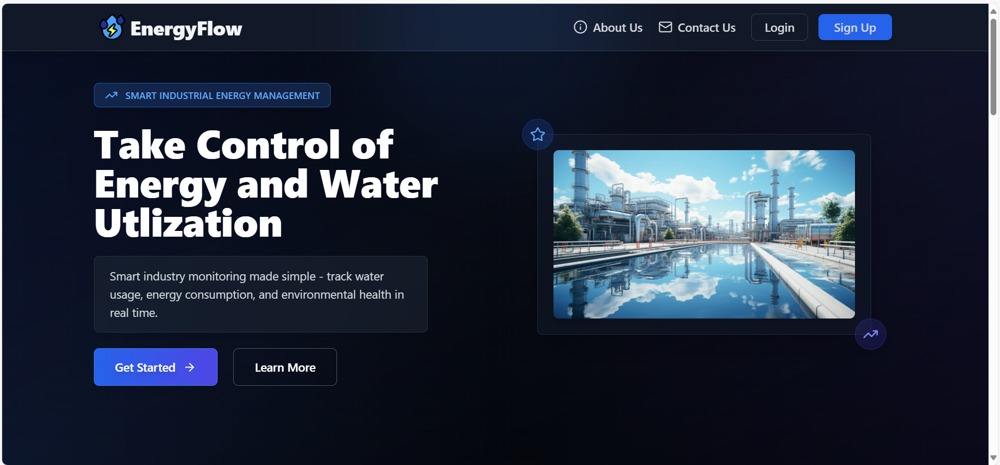
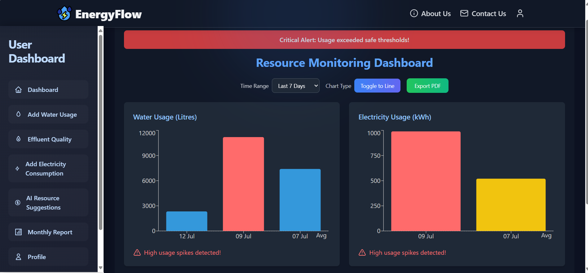
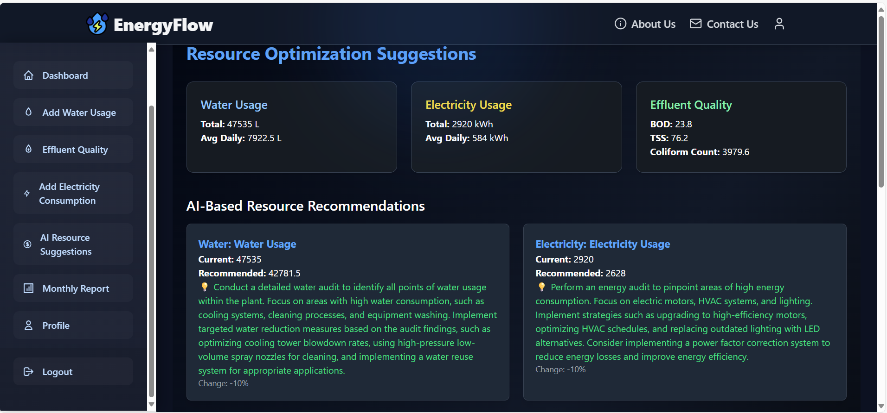
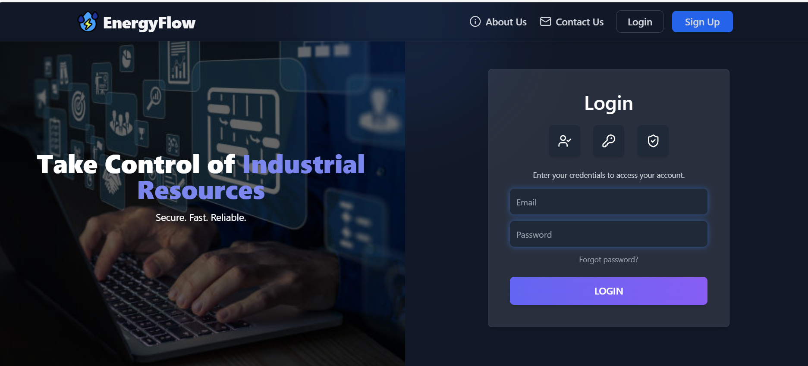
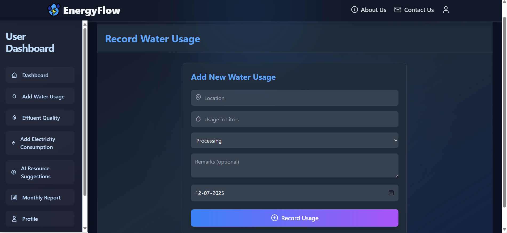
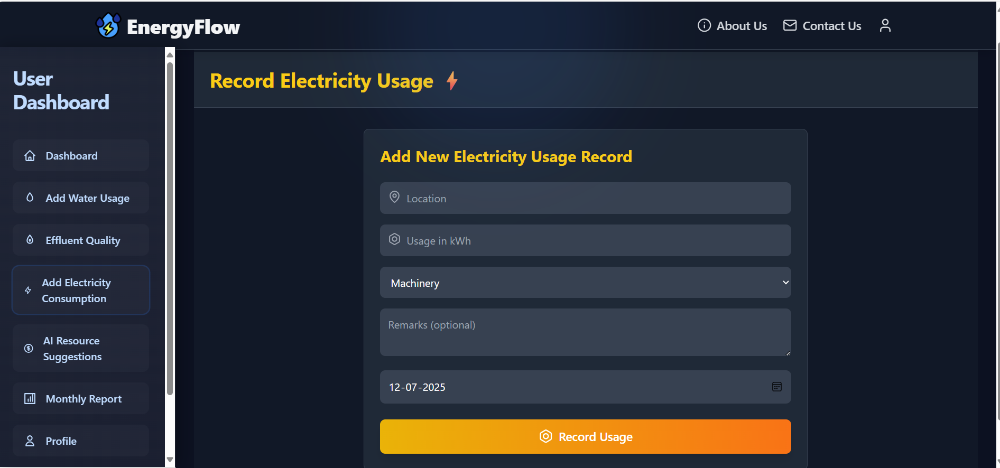
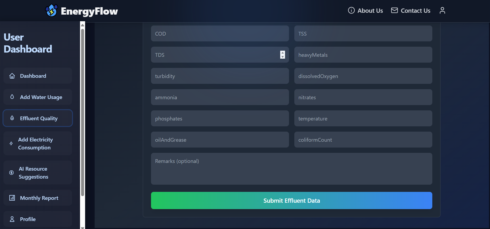
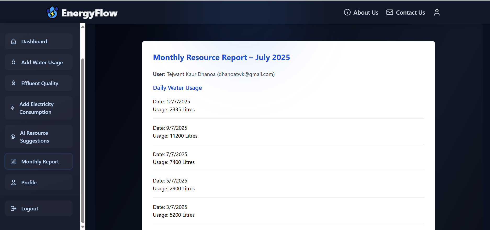
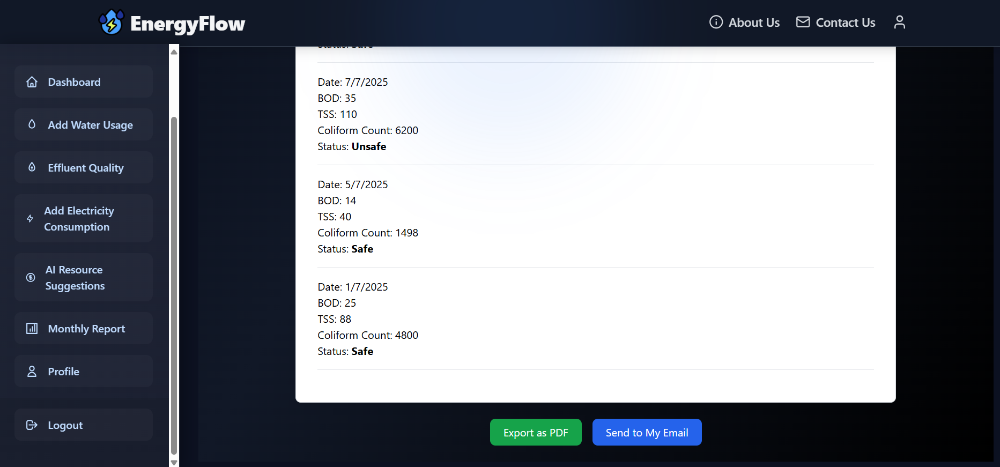
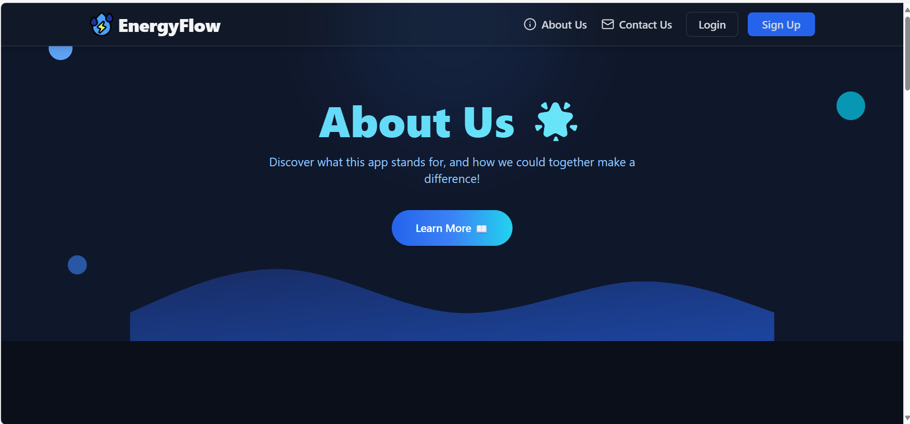
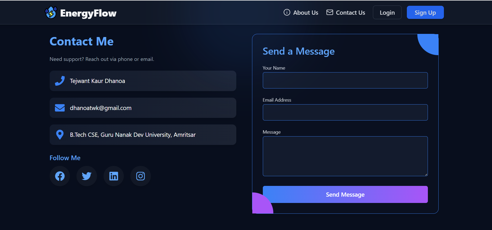
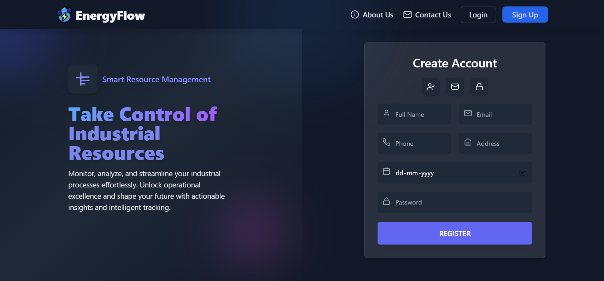
```

## 🧠 Core Features

| 🌟 Feature               | 🔍 Description                                                                |
| ------------------------ | ----------------------------------------------------------------------------- |
| 📊 Live Dashboard        | Displays water, electricity, and effluent stats with bar/line charts & alerts |
| 🤖 Gemini AI Suggestions | Analyzes data and offers actionable improvements in real time                 |
| 🧾 Monthly PDF Reports   | Generates structured documents and sends them via email to logged-in users    |
| 📨 Login Alerts          | Sends an email notification whenever a user logs in                           |
| 👤 Authentication Suite  | Signup, login, logout, view profile — all built in                            |
| 🖼️ Modern UI + Logo      | Sleek blue theme with handcrafted visuals and branding                        |
| 📃 About & Contact Pages | Polished site pages for professional presentation                             |
| 🌱 Environmental Logging | Encourages sustainability and compliance                                      |

---

## 🛠️ Tech Stack

- **Frontend**: React, Tailwind CSS
- **Backend**: Node.js, Express
- **Database**: MongoDB Atlas, Mongoose
- **AI Integration**: Gemini Suggestion Model
- **Reporting**: PDF-lib, Nodemailer
- **Deployment**: Netlify (Frontend), Render (Backend)

---

## 🏭 Industrial Relevance

- 📊 Logs all three key metrics: **water**, **electricity**, and **effluent quality**
- 📈 Allows **threshold tracking** and **AI-driven suggestions**
- 🧠 Promotes **sustainability** and **environmental compliance**
- 🗂️ Provides **monthly summaries** for internal review or audits
- 🔒 Secures user data with **industry-grade authentication** and schema design

---

## 📫 About the Developer

**👩‍💻 Tejwant Kaur Dhanoa**  
Final-year Computer Science student passionate about backend engineering, scalable systems, and meaningful impact through technology.

[🔗 LinkedIn Profile](https://www.linkedin.com/in/tejwant-kaur-dhanoa/)

---

This project highlights:

- 🔧 Full-stack development expertise
- 🎨 UI/UX design and branding
- 🧠 AI model integration
- 📤 Automation and reporting workflows
- 📦 Scalable backend systems
